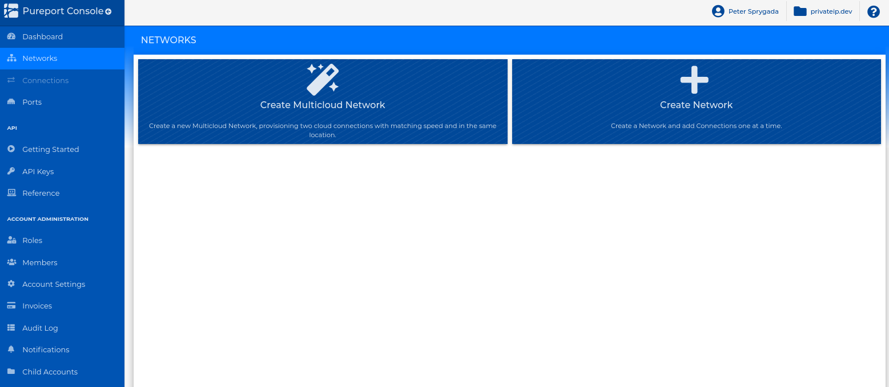

.. _create_networks:

=====================================
Creating a new cloud network
=====================================

.. contents:: 
   :local:

The first step in building a cloud native network using the Pureport Multicloud
Fabric is to creat a virtual networks.  From the Pureport Console, click on the
`Networks` link on the left side navigation bar.

